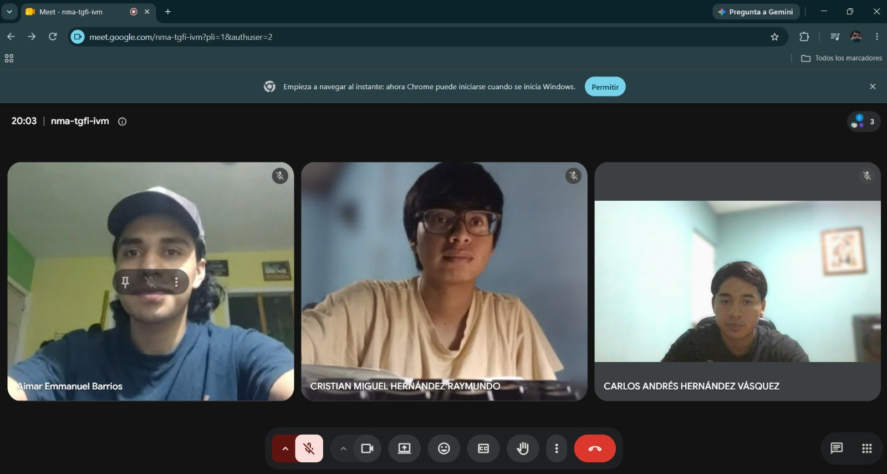

### Actividad-5-LAB-Asertiva
## Portada  
**Curso:** Comunicación Asertiva - Sección A  
**Universidad:** Universidad de San Carlos de Guatemala  
**Facultad:** Facultad de Ingeniería (FIUSAC)  
**Escuela:** Escuela de Ingeniería en Ciencias y Sistemas (ECYS)  
**Auxiliar**: Kevin Josue Santos Salazar  
**Integrantes:**  
| No. | Nombre                               | Carnet    |
|:---:|:------------------------------------:|:---------:|
| 1   | Aimar Emmanuel Barrios Gozalez       | 202502967 | 
| 2   | Carlos Andrés Hernández Vásquez      | 202501470 | 
| 3   | Cristian Miguel Hernandez Raymundo    | 202505139 | 

# Tarjeta 1: Establecer límites de forma profesional

**Situación:** Un compañero de equipo te escribe constantemente pidiéndote ayuda con su parte del trabajo. Tú ya terminaste tus tareas y tienes otras responsabilidades pendientes, pero él insiste en que le ayudes "solo un momento", varias veces.

**Reto:** Debes responder aplicando comunicación asertiva, estableciendo un límite claro sin afectar la relación.

**Objetivo:** Practicar cómo decir "no" de manera profesional, respetuosa y firme.

---

## 1. Identificar el problema comunicativo

- **Problema de fondo:** La otra persona insiste de manera repetitiva a pesar de que ya cumplí con mis asignaciones, lo que me quita tiempo vital para mis propias obligaciones.
- **Problema comunicativo:** Cómo poner un alto claro sin caer en dos extremos:
  - **Estilo pasivo:** Aceptar por pena o para evitar un mal momento, terminando cargando con pendientes ajenos y descuidando lo mío.
  - **Estilo agresivo:** Contestar de mala gana, enojarme o hacer sentir mal al compañero por estar insistiendo tanto.

## 2. Aplicar técnicas de comunicación asertiva

### a) Establecer el límite y decir "no" con profesionalismo

"Hola, la verdad entiendo perfectamente que quieras avanzar con tu parte y que sientas que es algo rápido. Dicho eso, ahorita sí tengo un montón de pendientes y responsabilidades mías que me toca sacar adelante, entonces ahorita no te voy a poder echar la mano con eso. Confío en que le vas a agarrar la onda para sacarlo, o si querés lo platicamos más al rato cuando desocupe un cacho de tiempo."

### b) Regulación emocional aplicada

- **Tono calmado:** Hablar de forma tranquila, sin sonar molesto ni sarcástico, manteniendo una actitud neutral pero segura.
- **Control de la comunicación:** Hacer pequeñas pausas antes de responder para no contestar a la defensiva por la insistencia, controlando los impulsos y cuidando el lenguaje corporal para transmitir seguridad y respeto mutuo.

## 3. Retroalimentación grupal

| Criterio | Evaluación del ejemplo |
| :--- | :--- |
| **Claridad del mensaje** | El mensaje rechaza la solicitud de forma directa y clara, especificando que existen prioridades pendientes y limitaciones de tiempo, sin rodeos ni ambigüedades. |
| **Tono utilizado** | Firme pero cordial; se reconoce la iniciativa del compañero con empatía, pero se mantiene la negativa de forma clara y respetuosa. |
| **Nivel de profesionalismo** | Se mantiene el enfoque en la gestión del tiempo y las responsabilidades individuales, evitando excusas falsas o ataques personales hacia la insistencia del compañero. |
| **Manejo emocional** | Se evidencia en la postura firme, el tono calmado y la capacidad de poner un límite sin culpa ni reacciones a la defensiva. |

## Conclusión del análisis

El problema no era la solicitud de ayuda en sí, sino el riesgo de no saber poner límites a tiempo. Usando una comunicación asertiva, el compañero comprende la situación sin sentirse atacado ni rechazado de forma grosera, logrando entender la carga de trabajo personal y evitando interrupciones que afecten el rendimiento de ambos.

# Tarjeta 2: Dar feedback a un compañero

**Situación:** Un integrante del equipo entregó su parte del trabajo, pero está incompleta y tiene varios errores. Esto está afectando el avance del grupo.

**Reto:** Dar retroalimentación utilizando una técnica adecuada (sándwich o situacional), evitando que se sienta atacado o desmotivado.

**Objetivo:** Practicar cómo dar feedback claro, útil y respetuoso.

---

## 1. Identificar el problema comunicativo

- **Problema de fondo:** el trabajo entregado está incompleto y con errores, lo cual afecta al equipo.
- **Problema comunicativo:** cómo señalar esto sin llegar a dos extremos los cuales serian:
  - **Estilo pasivo:** callar o minimizarlo por no incomodar, dejando que el problema siga afectando al grupo.
  - **Estilo agresivo:** reclamar el error de forma directa culpando a la persona ("no revisaste nada", lo que genera que este a la defensiva o molestias-
  
## 2. Aplicar técnicas de comunicación asertiva

### a) Técnica del sándwich
*(comentario positivo → aspecto a mejorar → cierre positivo)*

"Primero, gracias por entregar a tiempo, sé que tienes tus que haceres y tu trabajo. Revisando tu parte, noté que faltan algunos apartados y hay errores en los cálculos que pueden afectar la nota de la entrega, sería bueno revisarlos juntos antes de la entrega. Tienes buena base, pero arreglándolo antes de entregarlos podrias cumplir con lo requerido ."

### b) Técnica situacional
*(situación → comportamiento observado → impacto)*

"Sobre la entrega de ayer: noté que faltaron dos secciones y algunos datos no coinciden con lo acordado en la reunión. Esto nos está retrasando porque el resto del equipo depende de esa parte para avanzar y entre mas te atrases mas estrés genera y peor sera para todos. ¿Podemos revisarlo hoy para ajustarlo a tiempo?"

### c) Regulación emocional aplicada

- Tono calmado, sin sarcasmo, ni regaños regulando el temperamento a pesar del atraso.
- Pausa antes de hablar para no sonar frustrado.
- Enfoque en la conducta ("el trabajo tiene errores"), no en la persona así no generar desmotivación o miedo al compañero ("eres descuidado, o siempre tu atrasandote").

## 3. Retroalimentación grupal

| Criterio | Evaluación del ejemplo |
|---|---|
| **Claridad del mensaje** | El mensaje señala con precisión qué falta (secciones, errores en cálculos) y qué se espera (revisarlo juntos), sin rodeos ni ambigüedad. |
| **Tono utilizado** | Cordial y calmado en ambas técnicas; en la técnica del sándwich el tono es más suave por el marco positivo, en la situacional es más directo pero sigue siendo respetuoso. 
| **Nivel de profesionalismo** | Se mantiene el enfoque en el trabajo y el impacto en el equipo, evitando juicios personales ("eres descuidado") o generalizaciones ("siempre haces lo mismo"). |
| **Manejo emocional** | Se evidencia en la pausa antes de hablar, el lenguaje corporal abierto y el hecho de proponer una solución conjunta en vez de solo señalar el error. |

## Conclusión del análisis

El problema no era el error en sí, sino el riesgo de comunicarlo mal. Usando cualquiera de las dos técnicas, el compañero recibe la información necesaria para corregir sin sentirse juzgado por el trabajo sino mas bien sentir el apoyo por parte del equipo que lo tomo de forma adecuada y empatica, logrando así  avanzar sin fricción.

# Tarjeta 3: Negociar una fecha de entrega

**Situación:** Tienes varias entregas importantes el mismo día y no podrás cumplir con una de ellas a tiempo. Necesitas comunicarte con el docente o con tu equipo para solicitar una extensión.

**Reto:** Negociar una nueva fecha explicando tu situación de forma clara, responsable y profesional.

**Objetivo:** Practicar la negociación asertiva manteniendo credibilidad y compromiso.

---

## 1. Identificar el problema comunicativo

- **Problema de fondo:** acumulación de entregas importantes en la misma fecha, lo que impide cumplir con una de ellas a tiempo y con la calidad requerida.
- **Problema comunicativo:** cómo comunicar esta situación sin caer en dos extremos:
  - **Estilo pasivo:** no decir nada, entregar tarde o incompleto sin avisar, esperando que no pase nada.
  - **Estilo agresivo:** exigir la extensión como si fuera una obligación del docente como "tengo mucho trabajo, tiene que darme más tiempo" lo que genera rechazo y  poco a poco se va perdiendo credibilidad.

---

## 2. Aplicar técnicas de comunicación asertiva

### a) Técnica situacional
*(situación → comportamiento → impacto → propuesta)*

se podria decir como:
"Profesor, esta semana tengo tres entregas importantes programadas para el mismo día. Al revisar mi cronograma me di cuenta de que no podré dedicarle a esta entrega el tiempo que requiere para hacerla bien. Si la entrego así, el trabajo no reflejaría el esfuerzo ni la calidad que usted espera, y eso afectaría mi nota y mi aprendizaje. ¿Sería posible que me permitiera entregarla el [nueva fecha]? Mi plan es terminar las otras dos primero y enfocarme en esta durante los días siguientes."

### b) Técnica del sándwich
*(comentario positivo → aspecto a mejorar → cierre positivo)*

seria tipo: "Profesor, quiero agradecerle porque las indicaciones de la entrega fueron muy claras y me ayudaron a avanzar bien en la parte que ya tengo lista. Sin embargo, al revisar mis fechas noté que tengo varias entregas el mismo día y no podré terminar esta con la calidad que merece. Me gustaría pedirle si es posible una extensión hasta el [nueva fecha], comprometiéndome a entregar un trabajo completo y bien elaborado. Agradezco mucho su comprensión y quedo atento a su respuesta."

### c) Regulación emocional aplicada

- Tono calmado y respetuoso, sin sonar desesperado ni exigente.
- Pausa antes de hablar para ordenar las ideas y no caer en excusas emocionales.
- Enfoque en la responsabilidad propia como "no podré dedicarle el tiempo que requiere", o la tipica de culpar a otros "es que todos los profes dejan todo para el mismo día".
- Mantener lenguaje corporal abierto y actitud colaborativa durante toda la conversación.

---

## 3. Retroalimentación grupal

| Criterio | Evaluación del ejemplo |
|---|---|
| **Claridad del mensaje** | Se explica con precisión la situación la tres entregas el mismo día que dificultan, el motivo de la solicitud de no habrá tiempo suficiente y la propuesta concreta como nueva fecha y plan de acción. |
| **Tono utilizado** | Cordial y profesional en ambas técnicas; en la situacional es más directo pero respetuoso, en la del sándwich es más suave por el marco positivo inicial. |
| **Nivel de profesionalismo** | Se asume la responsabilidad, se evitan excusas y se propone una solución concreta con compromiso de cumplimiento. No se culpa al docente ni a otros cursos. |
| **Manejo emocional** | Se evidencia en la pausa previa, el tono controlado, la anticipación del aviso de no esperar hasta el último momento y la actitud colaborativa al proponer un plan. |

---

## Conclusión del análisis

El problema no era solo la falta de tiempo, sino el riesgo de comunicarlo mal: callar y entregar tarde (pasivo) o exigir la extensión como un derecho (agresivo). Usando cualquiera de las dos técnicas, el docente recibe la información necesaria para evaluar la solicitud sin sentirse presionado, y el estudiante mantiene su credibilidad y compromiso. La clave estuvo en avisar con anticipación, asumir la responsabilidad y proponer una solución concreta, logrando así una negociación respetuosa y efectiva.

### Imagen de la reunion:  
